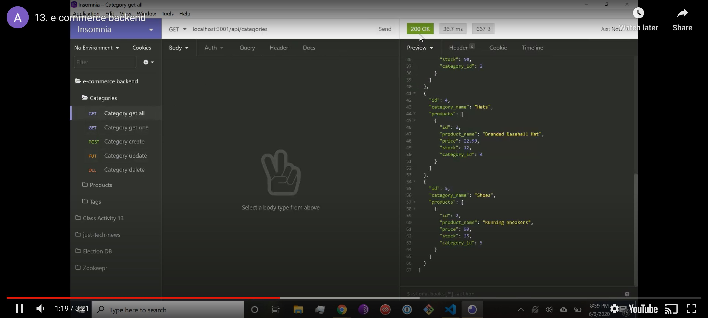

# Employee Tracker 

## Description
This application is an e-commerce back end that handles HTTP requests through a RESTful API by using Express for a Node server, MySQL for a database, and Sequelize for an object relational mapper. HTTP requests were tested using Insomnia Core.

## Table of Contents
* [Installation](#Installation)
  
* [Usage](#Usage)

* [License](#License)

* [Questions](#Questions)

## Installation
Installation instructions listed below:
```
npm init -y
npm install
```
  
## Usage
Create a file named .env in the parent directory for server.js with the line process.env.DB_NAME = 'YOUR_DB_NAME', DB_USER = 'YOUR_USERNAME', and DB_PW = 'YOUR_PASSWORD', where everything corresponds to your MySQL information. After running npm init and npm install, follow the below commands, ensuring to seed while an instance of the server is running. You can test using a browser or a program such as Insomnia Core.

```
mysql -u root -p
source db/schema.sql
npm start
npm run seed
```

[](https://www.youtube.com/embed/H39WDCseM40)

## License
A short and simple permissive license with conditions only requiring preservation of copyright and license notices. Licensed works, modifications, and larger works may be distributed under different terms and without source code.

To view the full license, [click here](./src/license/MIT.txt).

## Questions
If you have any questions, you can find me at [aelisker](https://github.com/aelisker) and via email at [alisker@protonmail.com](mailto:alisker@protonmail.com).
    